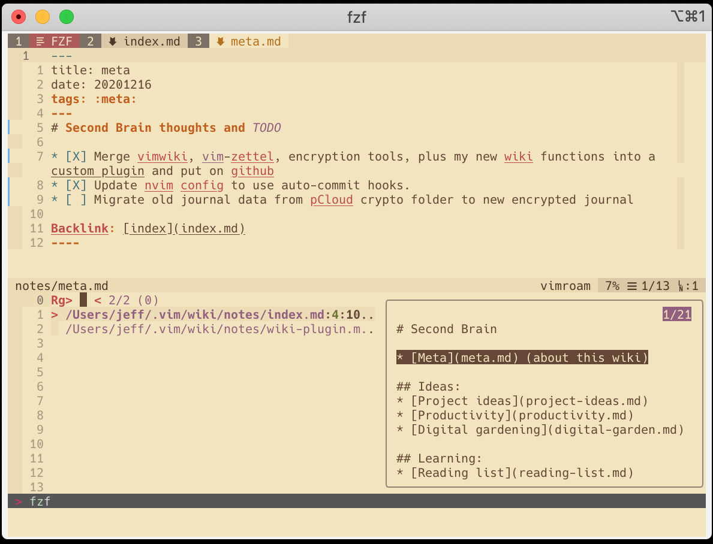
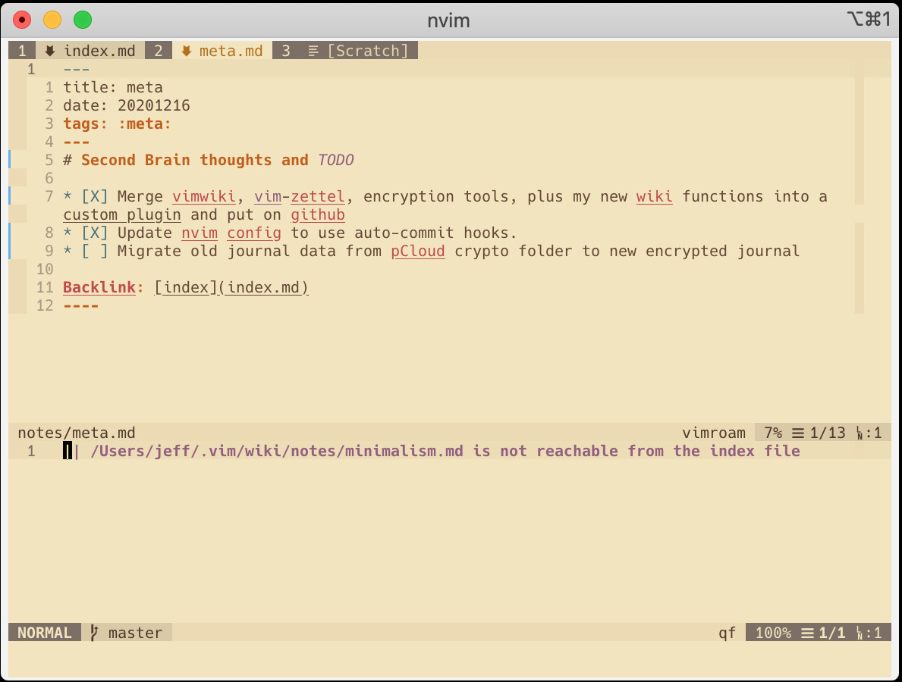
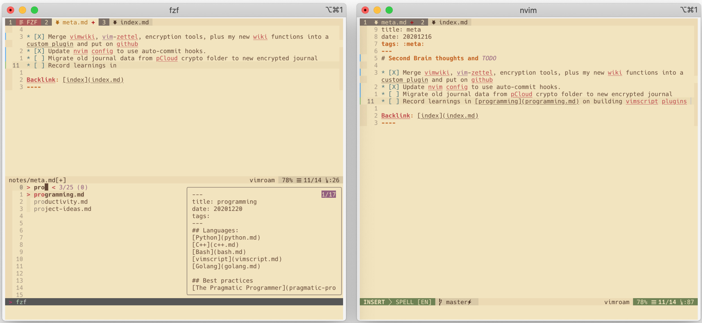
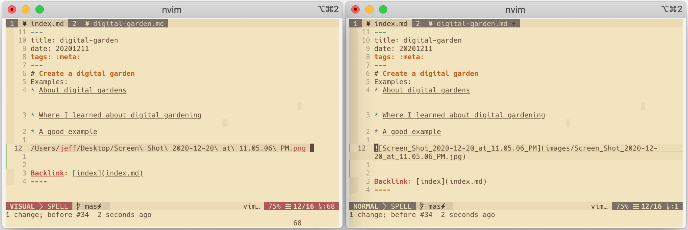

# roam.vim: A Vim-Powered and Roam-Inspired Wiki

- [Intro](#introduction)
- [Installation](#installation)
- [Using roam.vim](#using-roam.vim)
  - [Documentation](#documentation)
  - [Key Bindings](#key-bindings)
- [Reporting issues](#reporting-issues)
- [License](#license)

---

## Introduction

[Roam Research](https://roamresearch.com/) is a note-taking tool that eschews the typical hierarchical organization structure, and replaces it with an interconnected web of individual pieces of knowledge. In this way, information is organized in the same non-linear way that thoughts are organized in the brain, which is why this organization methodology also goes by names like "mind-mapping" and "second brain".

I wanted to build a Roam-like wiki of my own using the tool with which I am most productive: Vim. There are other great note-taking plugins out there, and my plugin of choice in the past had always been [VimWiki](https://github.com/vimwiki/vimwiki). I was inspired by the plugin [vim-zettel](https://github.com/michal-h21/vim-zettel) to build my own plugin that extends VimWiki to build a Roam-style wiki, powered by [`fzf.vim`](https://github.com/junegunn/fzf.vim) to quickly navigate notes using `ripgrep`

## Installation

### Requirements

- [vimwiki plugin](https://github.com/vimwiki/vimwiki)
- [fzf.vim plugin](https://github.com/junegunn/fzf.vim)
- [ripgrep](https://github.com/BurntSushi/ripgrep)
- ImageMagick (optional)

roam.vim has been tested on **NeoVim >= 0.4.4**, though it will likely work on recent versions of both Vim and NeoVim.

If you're not using NeoVim, make sure to add the following to your vimrc, otherwise roam.vim will not work:

```vim
set nocompatible
filetype plugin on
syntax on
```

This plugin is built on top of the [VimWiki](https://github.com/vimwiki/vimwiki) plugin, and makes heavy use of [fzf.vim](https://github.com/junegunn/fzf.vim). You will also need to install `ripgrep` and `ImageMagick` to make use of all of roam.vim's features. I also recommend the [markdown-preview](https://github.com/iamcco/markdown-preview.nvim) plugin to easily view your notes in HTML, rendered in real time.

Install the plugins using [vim-plug](https://github.com/junegunn/vim-plug) (or whichever other plugin manager you use):

```vim
Plug 'junegunn/fzf', { 'do': { -> fzf#install() } }
Plug 'junegunn/fzf.vim'
Plug 'vimwiki/vimwiki.vim'
Plug 'iamcco/markdown-preview.nvim'
Plug 'jeffmm/roam.vim'
```

## Using roam.vim

By default, `<Leader>ww` is used to the index of your wiki. Your index should be thought of a central hub -- a branching off point to begin building your wiki. By default, the index is located at `~/vimroam/wiki/index.md`. See `:h vimroam_list` for changing the wiki defaults.

You can begin building your wiki the following example:

```markdown
# My Second Brain

- Meta
- Projects
- Reading list
```

Placing the cursor on `Meta` and pressing `Enter` creates a link -- `Meta` becomes `[Meta](meta.md)`, a markdown link. Pressing `Enter` on a markdown link opens the file `meta.md`, creating it if necessary. The file will look like the following:

```markdown
---
title: meta
date: 20201216
tags:
---

## Backlink: [index](index.md)
```

Notice that the link back to the note that referenced this one -- a backlink -- is automatically generated. In fact, all references of the current page can be viewed and their files previewed using the command `:RoamBacklinks` (mapped to `<leader>wb` by default).



Pressing `Backspace` returns to the previous wiki page, in this case, the backlink `index.md`. A link can also be constructed from more than one word by visually selecting the words to be linked and press `Enter`. To try it, visually select `Reading list` from the index wiki and press `Enter`.

Often, the best use of roam.vim is for unstructured thinking and recording ideas that can be organized later. To create a new wiki note at any time, use the `:RoamNewNote` command (mapped to `<leader>wn` by default). You will be prompted to enter a note title if you so choose (the default is the current date and time in the format `YYYYMMDDHHmm`), and hit `Enter` to create and edit the new note.

You can organize the note by connecting it to another note later, either by entering a backlink or by linking to another note. You can find a list of all notes that are not currently traversable from the index wiki using the command `:RoamInbox` (mapped by default to `<leader>wi`). The inbox menu also lists defunct links.



A link to an existing note can be created quickly by typing `[]` in quick succession while in insert mode. This will display a list of existing notes, filtered by a fuzzy search, pressing enter on the note generates the link in full, and returns to insert mode.



You can also link to the current note from a different note by using the command `:RoamYankName` (mapped to `<leader>wy` by default) to yank a markdown link to the register, and then paste the link with `p`.

Links can be also be navigated via fuzzy search by searching all text with `:RoamText` (`<leader>ws`), by filename with `:RoamFiles` (mapped to `<leader>wf`), or by tags with `:RoamTags` (defined by any text surrounded by colons, e.g. `:meta:`, search mapped to `<leader>wt`).


You can also quickly add links to images that are saved to disk to create reference figures or screenshots that you can refer back to later. The easiest way (tested on Mac OSX using [iTerm2](https://iterm2.com/)) is to place your cursor where you want the image to appear in the note, then simply drag and drop the image into the terminal running Vim, which automatically inserts the image absolute path: `/path/to/my_image.jpg` (alternatively, you could have typed out the path yourself with the aid of omnicomplete). Visually selecting the full path and pressing `Enter` automatically copies the image to an `images` directory in your wiki, resizes and compresses the image using sane defaults (configurable, requires `ImageMagick` to be installed), and reformats the path to a relative markdown link: ``. Pressing `Enter` again on the generated link opens the image in your default image preview app. You can also see the image generated alongside the rest of the content in your wiki by running `:MarkdownPreview` in the wiki buffer.



### Documentation

- `:help roam-commands` -- List all commands.
- `:help roam` -- General roam.vim help docs.

### Key bindings

You can remap the keybindings yourself after adding the line `let g:roam_default_mappings=0` to your vimrc.

- `<Leader>ww` -- Open default wiki index file.
- `<Leader>wn` -- Create a new roam note.
- `<Leader>ws` -- Search wiki text.
- `<Leader>wf` -- Search wiki filenames.
- `<Leader>wt` -- Search wiki tags (defined as `:tag_name:`).
- `<Leader>wi` -- List unlinked notes and broken links.
- `<Leader>wb` -- List backlinks referencing the current note.
- `<Leader>wy` -- Yank markdown link to current note.
- `<Leader>wd` -- Delete current note (after confirmation).
- `<Leader>wr` -- Rename current note (after confirmation).
- `<Enter>` -- Follow/create markdown link.
- `<Backspace>` -- Go back to parent(previous) note.
- `<Enter>` -- (visual, selecting an image link) Create link to a copied image
- `[]` -- (insert) Insert link to an existing note, returning to insert mode.

Refer to the complete documentation at `:h roam-mappings` to see additional bindings.

## Reporting issues

If you need to report any bugs, use [GitHub issues](https://github.com/jeffmm/roam.vim/issues). Feature requests will also be considered, assuming they are within the scope of the plugin.

## License

[MIT License](LICENSE.md)
